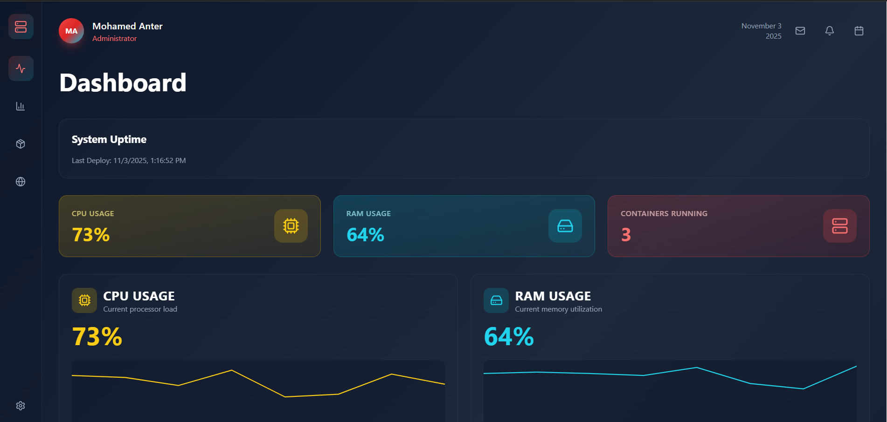
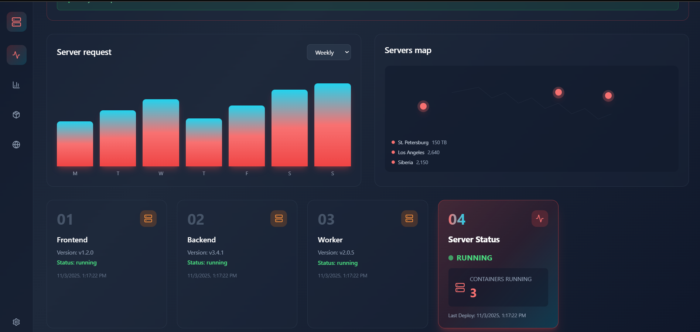
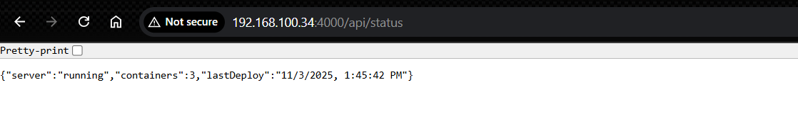
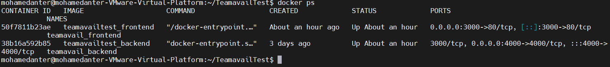
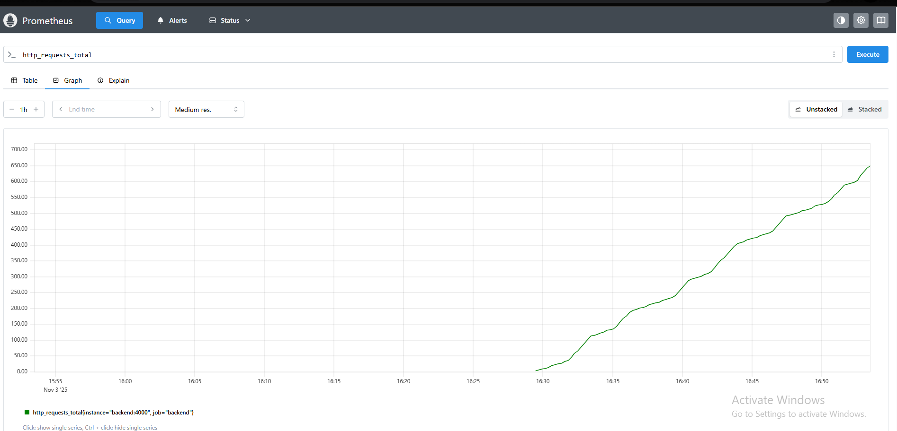
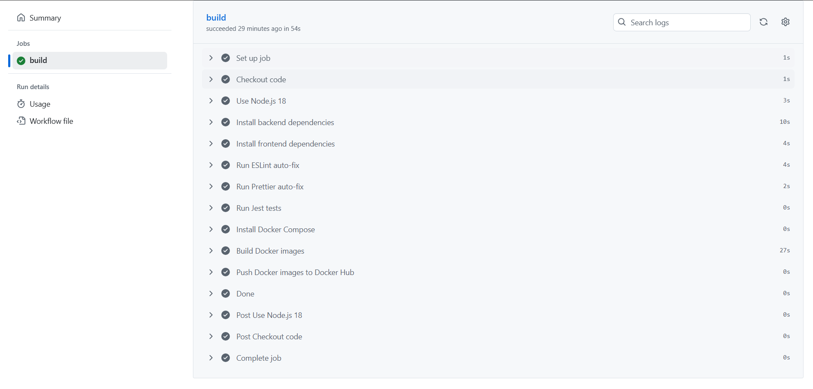

# 🧩 Teamavail Platform – Fullstack DevOps Project

A complete **Fullstack + DevOps** demonstration project built from scratch — featuring a modern **React frontend**, a **Node.js backend**, and a fully containerized environment managed through **Docker & GitHub Actions CI/CD**, integrated with **Prometheus + Grafana monitoring**.

---

## 🚀 Project Overview

This project showcases a full development and deployment pipeline:

- **Frontend:** React + Vite + TailwindCSS
- **Backend:** Node.js + Express
- **Containerization:** Docker & Docker Compose
- **CI/CD:** GitHub Actions (build, lint, test, push Docker images)
- **Monitoring:** Prometheus + Grafana
- **Future-ready for Cloud Deployment:** AWS / Azure / GCP

---

## ⚙️ Architecture

+-------------------+           +--------------------+
|   Frontend (React)|  --->     | Backend (Express)  |
|   http://localhost:80         | http://backend:4000 |
+-------------------+           +--------------------+
|

Docker Compose Network

**Services:**
- `frontend`: React app served via Nginx

## Frontend

The React frontend provides the user interface and dashboards to visualize application data.

Frontend URL: [http://localhost:80](http://localhost:80)

**Frontend UI Main Page**  

**Dashboard 1**  


**Dashboard 2**  


---
- `backend`: Node.js API server with REST endpoints
## Backend

The Node.js backend exposes REST endpoints and metrics for monitoring.

Backend API URL: [http://localhost:4000/api/status](http://localhost:4000/api/status)

**Backend Metrics (/metrics)**  



---
- `ci.sh`: local CI pipeline script
- `deploy.sh`: deployment automation script

---

## 🐳 Docker Setup

Build and start everything:

```bash
docker-compose up -d --build

----------------

Access the app:

Frontend → http://localhost:80

Backend → http://localhost:4000/api/status

```bash
docker-compose down
```
<div style="display: flex; gap: 10px; flex-wrap: wrap;"> <div style="flex: 1;"> <b>Frontend UI</b><br>  </div> <div style="flex: 1;"> <b>Backend /metrics</b><br>  </div> <div style="flex: 1;"> <b>Docker Compose running</b><br>  </div> </div>

-------------------
```bash

🔁 CI/CD with GitHub Actions

Pipeline includes:
✅ Checkout code
⚙️ Setup Node.js
🧹 Run ESLint + Prettier
🧪 Run tests
🐳 Build Docker images
☁️ Push image to Docker Hub
```

-------------------------------------------------
```bash

📊 Monitoring (Prometheus + Grafana)

Prometheus scrapes backend metrics: http://backend:4000/metrics

Grafana visualizes metrics from Prometheus

Dashboards include: HTTP Requests, CPU, Memory, Event Loop Lag
```


--------------------------------------
```bash

🧠 Key Learnings
------------------
Built a multi-service architecture with Docker Compose

Connected services through an internal Docker network

Automated build, lint, and test stages with GitHub Actions

Managed Docker image publishing via CI/CD

Integrated Prometheus + Grafana monitoring

Prepared setup for future AWS/GCP deployment

````````
----------------------------------------

